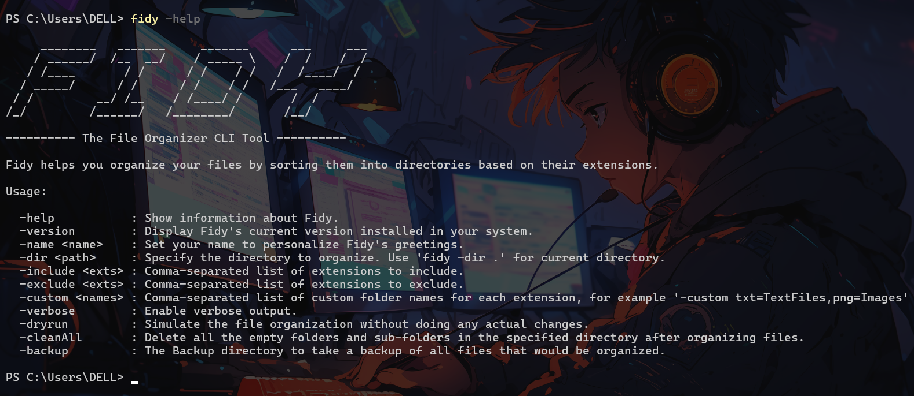

# Fidy

Fidy is a command-line tool for organizing files in a directory based on their extensions. It helps you keep your workspace tidy by categorizing files into folders named after their extensions.



## Features

- **Organize Files by Extension**: Automatically move files into directories based on their file extensions.
- **Custom Greetings**: Save a custom name to personalize your Fidy experience.
- **Verbose Mode**: Get detailed output of the operations performed.
- **Dry Run**: Simulate the organization process without making any changes.
- **Custom folder names**: Customise the folder names created by Fidy for each file extension.
- **Clean empty directories**: Recursively delete all empty folders and sub-folders within the target directory.

## Installation

### 1. Download the installer executable for Windows. (Recommended)

The installer file can be downloaded from [Fidy Installer](./deployment/fidy_Installer.exe). Download the exe file and run it to install Fidy.

Open your terminal and run Fidy!
```
fidy
```


### 2. Install using 'go install' command.

Make sure you have [Go](https://go.dev/doc/install) installed in your system.

You can install Fidy using the following command in your terminal:
```
go install github.com/ashmit0920/Fidy@latest
```

Run fidy
```
fidy
```
**Update:** Fidy will be released soon as a binary for Linux and MacOS!

## Usage

Display info about Fidy
```
fidy -help
```

Fidy can remember your name and send personalized greetings! Set your name using the command:
```
fidy -name YOUR_NAME
```

Check the installed version
```
fidy -version
```

Organize a directory
```
fidy -dir PATH_TO_YOUR_DIR
```

Include or exclude specific file extensions
```
fidy -dir PATH_TO_YOUR_DIR -include txt,png -exclude pdf
```

Organize files with verbose output
```
fidy -dir PATH_TO_YOUR_DIR -verbose
```

Perform a Dry Run to simulate the process, without doing any actual changes to your directory.
```
fidy -dir PATH_TO_YOUR_DIR -dryrun -include txt,png -exclude pdf
```

Give custom names to folders created by Fidy for each extension.
```
fidy -dir PATH_TO_YOUR_DIR -custom png=Images,pdf=Documents,mp4=Videos
```


Clean all the empty folders and sub-folders within your target directory.
```
fidy -dir PATH_TO_YOUR_DIR -cleanAll -verbose
```

Fidy can take a backup of all your files before organizing them. Use the `-backup` flag to specify the directory where you want your backup folder to be created. 
```
fidy -dir PATH_TO_YOUR_DIR -backup PATH_TO_BACKUP_DIR -include png -custom png=Images -verbose
```


## Upcoming features

- Log file
- Backup before running Fidy
- Recursive organization for sub-directories